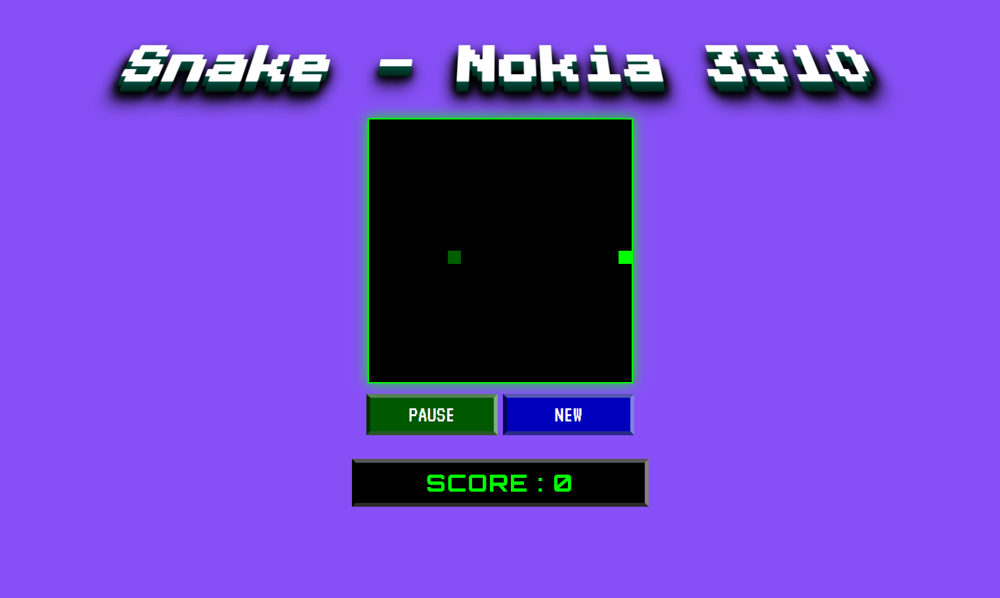

# 🐍 Snake Nokia 3310 – Retro JS Game

> *“Welcome back to the 00's!”*
> A modern remake of the classic Snake game with a digital LCD style inspired by the Nokia 3310, built with **HTML / CSS / vanilla JS**.

---

## 🔗 Link
https://snake-3310.netlify.app/

---

## 🚀 Preview


* ✅ Keyboard control (arrow keys)
* ⏸ **Pause / Resume** system (`P` / `S` or button)
* 🆕 **Quick restart** (via button or menu)
* 💾 Score displayed in **Orbitron LCD style**
* 🎮 UI inspired by the early 2000s (Press Start 2P, VT323, Pixelify)

---

## 🗂️ Project structure

```bash
.
├── index.html        # Page structure
├── style.css         # Retro styles and animations
├── snake.js          # Snake game logic
└── README.md         # This file
```

---

## 🎮 Keyboard controls

| Key               | Action          |
| ----------------- | --------------- |
| ⬅️ / ➡️ / ⬆️ / ⬇️ | Move the snake  |
| `P`               | Pause the game  |
| `S`               | Resume the game |

---

## 📆 Installation

1. Clone the repo or download the files:

   ```bash
   git clone https://github.com/your-username/snake-nokia3310.git
   cd snake-nokia3310
   ```

2. Open `index.html` in your browser:

   ```bash
   open index.html
   ```

✅ No build tools or dependencies needed: **pure HTML/CSS/JS**.

---

## 🎨 Fonts used (Google Fonts)

* [`Orbitron`](https://fonts.google.com/specimen/Orbitron) – digital display
* [`Press Start 2P`](https://fonts.google.com/specimen/Press+Start+2P) – arcade typography
* [`VT323`](https://fonts.google.com/specimen/VT323) – old-school terminal
* [`Pixelify Sans`](https://fonts.google.com/specimen/Pixelify+Sans) – pixel readability

---

## 🧠 Technical features

* 📊 Dynamic grid based on `gridSize` (20x20 cells)
* 🍎 Random food generation
* 💥 Wall and self-collision detection
* 🧠 Pause / resume via button or keyboard
* 🖼️ Styled start modal
* 📱 Responsive centered layout with flexbox

---

## 💡 Credit & Inspiration

* Visual design inspired by the Nokia 3310
* Classic Snake remade in **early 2000s retro style**
* Made with ❤️ by \[your name or alias]

---

## 📸 Screenshot


